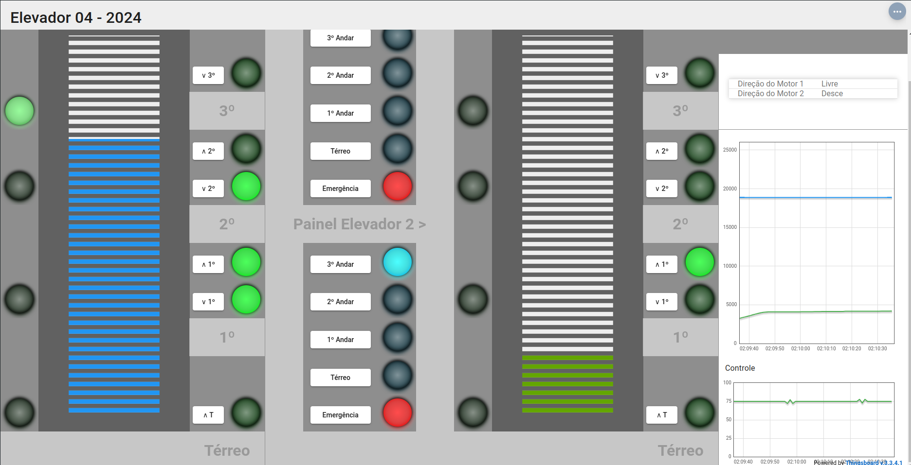

# Trabalho 2 de Fundamentos de Sistemas Embarcados

Professor Responsável: [Prof. Dr. Renato Coral](https://www.pesquisar.unb.br/professor/renato-coral-sampaio)
Período: 2024/1

## Descrição

Este projeto é parte da disciplina de **Fundamentos de Sistemas Embarcados** do curso de Engenharia de Software da Universidade de Brasília (UnB). O objetivo principal visa desenvolver um sistema completo de controle de elevadores prediais, utilizando a para monitoramento e controle de movimentação, acionamento de botões internos e externos, e monitoramento de temperatura. O controle de movimentação é realizado por motores elétricos, com a posição monitorada por sensores de posição e encoders.

O ESP32 é um módulo compacto que integra Wi-Fi e Bluetooth de baixo consumo, ideal para aplicações em automação residencial, dispositivos IoT, e sistemas embarcados em geral.

Os elevadores são integrados ao ThingsBoard para monitoramento e controle remoto, hospedado pelo professor responsável pela disciplina.

## Gravação

A apresentação desse trabalho foi gravada e o video pode ser conferido aqui: [Vídeo](https://www.youtube.com/watch?v=4t_O5NHRQhg)

(disclaimer: o elevador 2 estava extremamente lento e começou a subir pouco após a gravação do vídeo, vide imagem abaixo do momento: 

## Comandos para Construção e Execução

Os comandos a seguir são utilizados para compilar e executar o projeto:

## Como Executar

1. Clone o repositório: Use o comando `git clone` com o link do repositório para baixar o projeto, entre na pasta usando cd e o nome da pasta do projeto.
2. Configuração do Ambiente: Certifique-se de que o ambiente de desenvolvimento está configurado com a ESP-IDF e as bibliotecas necessárias instaladas.
3. Upload do Firmware: Utilize o comando `make -f Makefile.linux flash` para gravar o firmware no ESP32.
4. Execução: Compile e execute o código utilizando o comando `make build`.

## Estrutura do Projeto

- **src/**: Contém os arquivos fonte principais do projeto em C/C++.
- **include/**: Arquivos de cabeçalho (headers) utilizados no projeto.
- **build/**: Diretório gerado após a compilação, contendo os arquivos binários.
- **Makefile**: Arquivo principal de build que define como o projeto deve ser compilado.
- **Makefile.linux**: Versão específica do Makefile para as bibliotecas ssd1306.
- **Makefile.common**:  Versão auxiliar do Makefile para compilação das bibliotecas ssd1306.

## Uso

1. **Conecte a placa** ESP32 ao computador via ssh.
2. Certifique-se de que os drivers estão instalados e que a placa é reconhecida.
3. No terminal, navegue até o diretório do projeto e execute os comandos desejados:
   - `make -f Makefile.linux flash` para compilar a biblioteca ssd1306 devidamente.
   - `make build` para compilar e executar o programa.
4. Verifique o funcionamento do sistema acompanhando pelo respectivo Thingsboard dos elevadores.

## Contribuições

Sinta-se à vontade para contribuir com melhorias no projeto, seja com correções de bugs, novas funcionalidades ou melhorias na documentação. Envie suas sugestões através de pull requests ou entre em contato diretamente com o professor responsável pela disciplina.

## Licença

Este projeto é distribuído sob a licença MIT.

